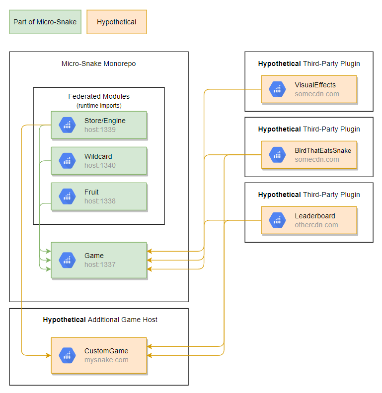

# Snake with Runtime Plugin Support

This project flips the script on Micro-Frontends expansion. Typical micro-frontends extend functionality in a lateral/horizontal manner, adding additional pages or components. This project exemplifies Micro-Frontends in a "stacking" or vertically expanding manner, each Micro-Frontend rendering it's own `<canvas>` to be stacked on top of all other canvas.

The end result is a game of Snake with runtime-plugin support.

## Play

#### Github Pages

[firstwhack.github.io/a-game-of-micro-frontends/game](https://firstwhack.github.io/a-game-of-micro-frontends/game)

#### Online IDE

This example runs in [Code Sandbox](https://githubbox.com/FirstWhack/a-game-of-micro-frontends)!

## Runtime Architecture

# Contents

## GameStore

Exposed at http://localhost:1339

This module holds the game engine itself, it is a simple MobX store exposing observables and methods to modify the game state.
No output is rendered by this module.

Public API:

- methods:
  - `setPlayerPosition()` - update the player's position to a new Vector2d
  - `getRandomPosition()` - always returns a _new_ random Vector2d within the bounds of play area
  - `setVelocity()` - update the player velocity
  - `setFPS()` - set the game speed
  - `setTailSize()` - update the maximum tail size
  - `suspendGame()` - suspends (does not destroy) the current game
  - `startGame()` - starts the game, safe to call even if game is already started
- Properties:
  - `gridSize` - the current grid size (defaults to 20)
  - [observable] `playerPosition` - Vector2d position of the player
  - [observable] `trail` - list of all coordinates that are part of the curent Player Trail
  - `fps` - the current game speed
  - [computed] `frameInterval` - the frameInterval in-use by the render engine, computed based on the value of `fps`
  - `running` - determines whether the render loop is executing
  - [observable] `tailSize` - the maximum size of the player's tail
  - [computed] `score` - the tail size minus starting tail size
  - `lastFrameTime` - the time of the last frame render, used by the render engine to control game/render speed
  - `velocity` - Current Velocity2d of the player. e.g. `{x: 1, y: 0}` = player is moving to the "right" by 1 tile at a time

## Game

Runs at: http://localhost:1337

This module renders the Snake itself based on the game state provided by the GameStore.

This module also resolves any plugins at runtime via Webpack's Module Federation Plugin. Plugins are rendered into Game's Stage as individual Layers (**each plugin provides it's own `<canvas>` element!**)

## Plugins

### Plugin Information

Plugins are allowed to do almost anything they would like.

At a minimum, a plugin is expected to consume the game state from prop `gameStore`, render something into it's own `<Layer>` (it's own `<canvas>` element), and register a reaction to produce a side-affect.

### Fruit

Exposed at: http://localhost:1338

#### Apple

- Type: Reward
- Tunctionality
  - Renders a Red `<Rect>` to a random position in the canvas
  - Reacts to changes in Player/Apple Position, when collisions occur the Tail Size is increased

#### Plum

- Type: Penalty
- Functionality
  - Renders a Purple `<Rect>` to a random position in the canvas
  - Reacts to changes in Player/Plum Position, when collisions occur the game speed is increased for a short duration, eventually returning to the non-penalized state.

### Wildcard

Exposed at: http://localhost:1340

#### Teleport

- Type: Exotic
- Functionality
  - Renders an Orange `<Star>` to a random position in the canvas
  - Reacts to changes in Player/Orange Position, when collisions occur the Player Position is set to a random location. The GameStore continues to advance the Player based on existing Velocity from the new position.
